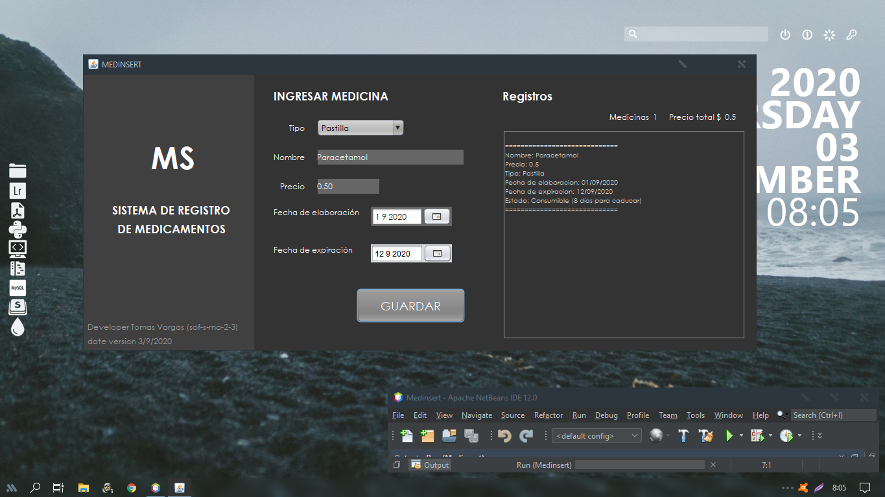
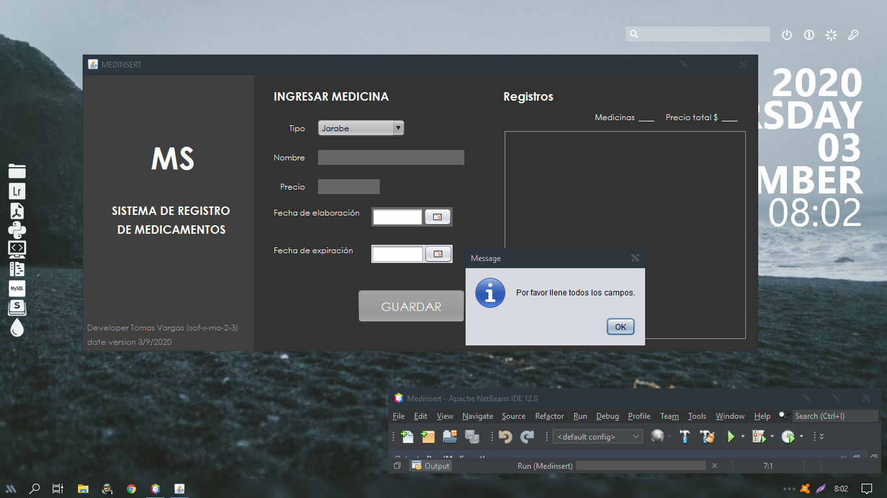
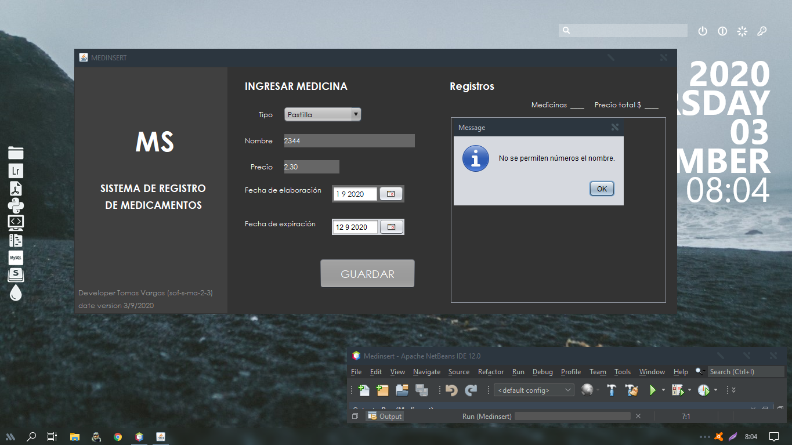
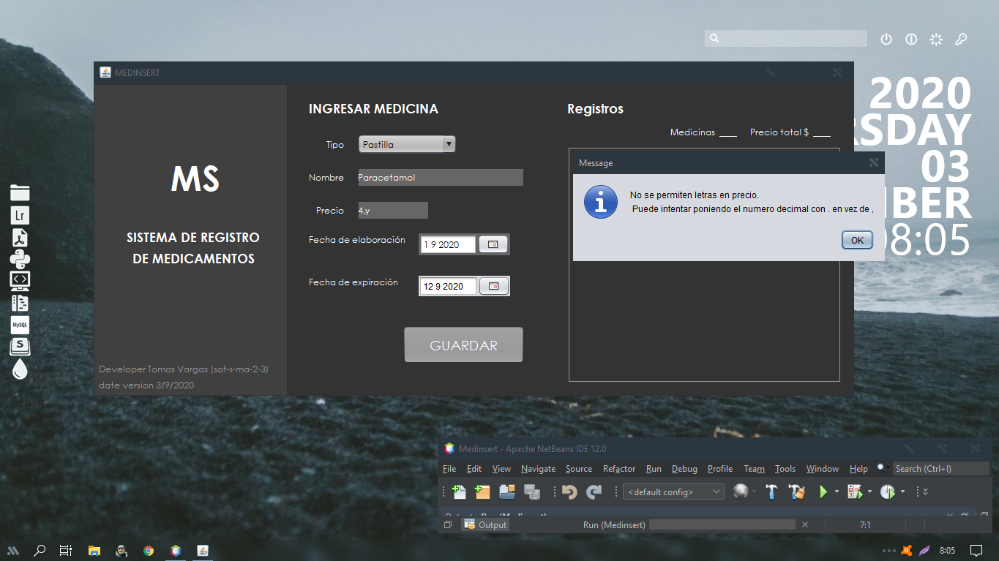

# MEDINSTERT

## Abstract
This software registers medications and shows the data including how long until the expiration of said medicine, it also shows the total of registered medicines and the total valuation that is expected as total earnings.
This program has validations to not leave empty fields or data that can generate an error such as a letter in the price field.

## Resumen
Este software registra medicamentos y muestra los datos incluyendo que tiempo falta para que caduque  dicha medicina, también muestra el total de medicinas registradas y la valoración total que se espera como ganancias totales.
este programa cuenta con validaciones para no dejar campos vacios o datos que puedan generar error como una letra en el campo de  precio.

## Some screenshots

